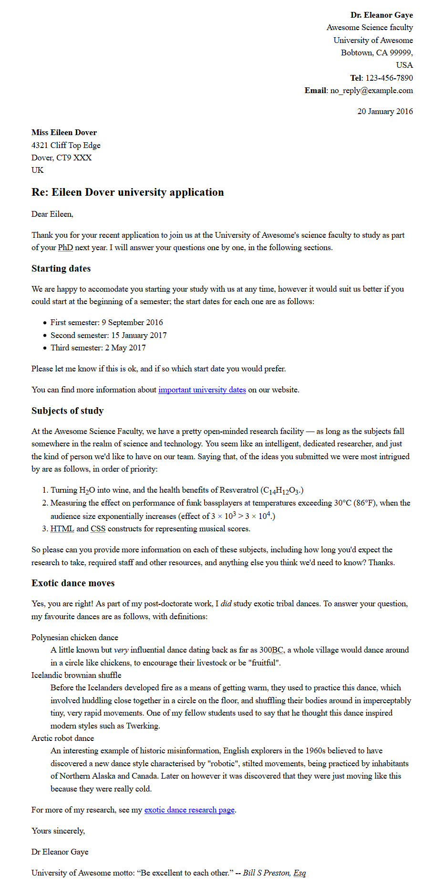

Taken from the [MDN Learn HTML site](https://developer.mozilla.org/en-US/docs/Learn/HTML/Introduction_to_HTML/Marking_up_a_letter).

# Marking up a letter

For this project, your task is to mark up a letter that needs to be hosted on a university intranet. The letter is a response from a research fellow to a prospective PhD student concerning their application to the university.

Create an `index.html` page for your solution. Use the `letter-text.txt` file for the content of your page and include `styles.css` for the styles. Your aim is to have something that looks like the following image.

Block/structural semantics:

* You should structure the overall document with an appropriate structure including doctype, and <html>, <head> and <body> elements.
* The letter in general should be marked up with a structure of paragraphs and headings, with the exception of the below points. There is one top level heading (the "Re:" line) and three second level headings.
* The semester start dates, study subjects and exotic dances should be marked up using an appropriate list type.
* The two addresses should be put inside <address> elements. Each line of the address should sit on a new line, but not be in a new paragraph.

Inline semantics:

* The names of the sender and receiver (and "Tel" and "Email") should be marked up with strong importance.
* The four dates in the document should be given appropriate elements containing machine-readable dates.
* The first address and first date in the letter should be given a class attribute value of "sender-column"; the CSS you'll add later will then cause these to be right aligned, as should be the case in a classic letter layout.
* The five acronyms/abbreviations in the main text of the letter should be marked up to provide expansions of each acronym/abbreviation.
* The six sub/superscripts should be marked up appropriately — in the chemical formulae,  and the numbers 103 and 104 (they should be 10 to the power or 3 and 4, respectively).
* Try to mark up at least two appropriate words in the text with strong importance/emphasis.
* There are two places where a hyperlink should be added; add appropriate links with titles. For the location that the links point to, just use http://example.com.
* The university motto quote and citation should be marked up with appropriate elements.

The head of the document:

* The character set of the document should be specified as utf-8 using an appropriate meta tag.
* The author of the letter should be specified in an appropriate meta tag.
* The provided CSS should be included inside an appropriate tag.

## Solution

Check out [solution.html](solution.html) for one possible solution along with [a writeup about the solution](solution.md)
